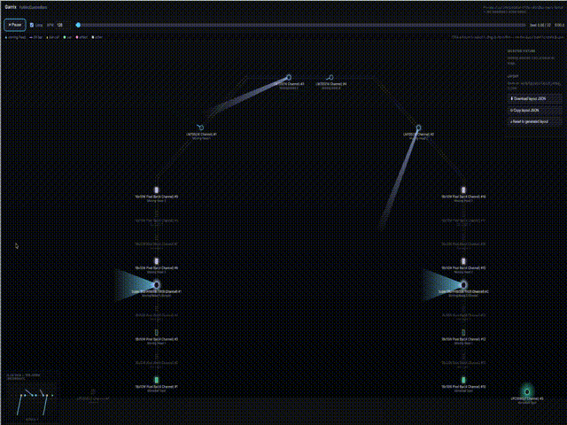
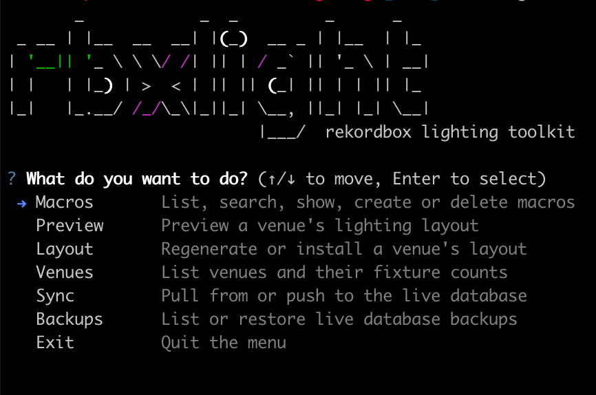

# rekordbox-lighting

Author rekordbox lighting macros from files instead of fighting the GUI — and **see what they look
like without wiring up a single light.**

```
rbxlight pull                 # copy the live databases to a safe working copy
rbxlight preview 10006        # open a macro in the visualizer
rbxlight push --write         # send changes back to rekordbox (backs up first)
```

---

> **Disclaimer:** This is an unofficial, community-made tool. It is not affiliated with, endorsed
> by, or supported by Pioneer/AlphaTheta in any way. Rekordbox is a trademark of AlphaTheta
> Corporation. There is no warranty and no liability for any damages, data loss, or gig mishaps
> arising from its use — **use at your own risk.**

---

## ⚠️ Your rig and venues are not generic

The skill in `.opencode/skills/physical-rig-profile/SKILL.md` documents **one specific person's physical lighting rig** — the fixtures they own, where they're mounted, and how they patch into rekordbox. If you're not that person, **you must edit that skill to match your own hardware before generating or previewing anything.**

The tool loads this skill as ground truth about the physical world. If it's wrong, macros won't fail loudly — they'll produce motion aimed at fixtures that don't exist, or light changes on hardware that can't perform them. Silently.

The same applies to any venue and fixture layout files committed to this repo. Edit them or regenerate them to match your setup.

---

## ⚠️ Read this before anything else

This tool writes to your **live rekordbox lighting databases**. Those are the light show you perform
with. If you break them, you break a gig.

Four rules the tool enforces for you, but which you should know anyway:

1. **Quit rekordbox before writing.** rekordbox holds these files open and writes its own copy of
   everything when it exits — it will silently wipe out changes made behind its back. The tool
   refuses to write while rekordbox is running.
2. **Every write takes a backup first.** Timestamped, in `backups/`. No backup, no write.
3. **Nothing is written unless you say `--write`.** Every mutating command shows you what it would do
   and then stops.
4. **Your factory macros are untouchable.** The tool physically cannot modify or delete them.

If something goes wrong, skip to [Undoing a mistake](#undoing-a-mistake).

---

## What this is for

The rekordbox lighting GUI is slow to work in. This tool exists so you can:

- **See a macro without a rig.** A single HTML file draws your truss and animates the macro across it.

  

- **Duplicate and transform macros** — clone, recolour, stretch, mirror — without clicking through menus.
- **Generate macros from code** — chases, sweeps, ping-pongs, colour cycles, strobe hits.
- **Edit macros as text.** Export to YAML, edit in any editor, import back.
- **Generate macros with an LLM.** An agent setup lets you describe a macro in plain language and
  have an LLM produce it for you.

Everything runs offline on your own machine. Nothing is uploaded anywhere.

---

## Installation

You need Python 3.12 or newer. Check with `python3 --version`.

```bash
git clone <repo-url>
cd rekordbox-lighting
python3 -m pip install -e ".[dev]"
```

Alternatively, if you have [mise](https://mise.jdx.dev/) installed, use `mise run install` instead of the pip command.

Verify it worked:

```bash
rbxlight --help
```

If `rbxlight: command not found`, your Python scripts folder isn't on your `PATH`. Use
`python3 -m rbxlight.cli` instead of `rbxlight` everywhere below — everything else is identical.

---

## The five-minute tour

### Step 1 — Quit rekordbox

Actually quit it. Not minimised. The tool will refuse to continue otherwise, which is the point.

### Step 2 — Copy your data to a safe place

```bash
rbxlight pull
```

This copies `macro.db3` and `user.db3` from rekordbox into `work/`. **Everything you do from here
happens on that copy**, never on the real thing. It also records a fingerprint of the originals so it
can later tell whether they changed behind your back.

### Step 3 — Look at a macro

```bash
rbxlight preview 10006
```

That writes `preview_10006.html`. Double-click it. Your browser opens and you see your rig —
the arch, the bars, the moving heads, the pars — with the macro animating across it.

Press play. Drag the timeline. Change the BPM.

> **How do I find a macro's number?** Every macro has an id. Yours (the ones you made) start at
> **10001**. Factory macros are 1–916. See [Finding things](#finding-things) below.

### Step 4 — Fix the light positions

The first preview probably won't match your room, because **rekordbox doesn't store where your lights
physically are** — the tool has to guess.

In the visualizer:
- **Click** a light to select it
- **Drag** it where it actually belongs
- Use the **rotation slider** if it's mounted at an angle
- Arrow keys nudge, `[` and `]` rotate

When it looks right, click **Download JSON** and save the file to:

```
work/layouts/layout_venue_2.json
```

(overwrite what's there). Every preview from now on uses your positions. You only do this once.

### Step 5 — Send changes back to rekordbox

Only when you've actually changed something and want it live:

```bash
rbxlight push            # shows you what would happen — changes nothing
rbxlight push --write    # actually does it, after backing up
```

Reopen rekordbox and your changes are there.

---

## Interactive menu

Run `rbxlight` with no arguments — or `rbxlight tui` explicitly — and you get a menu instead of
having to remember commands:



Every existing command still works exactly as before, including `rbxlight --help`.

**Every mutating action is a dry-run first.** Pick an action and the menu always shows you the
plan — what would change — before it asks you to confirm anything. There's no way to skip straight
to a write. Confirmations default to **No**.

Working-copy actions (macro create/delete, layout regenerate/install, sync pull) are disposable and
reversible, so they just ask a plain yes/no. Anything that touches your **live** rekordbox databases
(sync push, restoring a backup) gets a distinct, harder-to-miss warning: it names exactly which live
files will be overwritten, the backup that will be taken first, and the exact command you'd run to
restore it — and instead of `y`, it makes you type a confirmation word.

The menu needs a real interactive terminal. If stdin/stdout isn't a TTY (scripts, cron, CI), it
refuses to start and tells you to use the CLI commands directly instead — the CLI remains the
supported way to script or automate this tool.

---

## Everyday commands

| I want to... | Command |
|---|---|
| Copy live data to the working copy | `rbxlight pull` |
| Preview a macro | `rbxlight preview 10006` |
| Preview using a different venue | `rbxlight preview 10006 --venue 3` |
| Save the preview somewhere specific | `rbxlight preview 10006 --output ~/Desktop/test.html` |
| See what a change would do | run the command **without** `--write` |
| Actually apply it | add `--write` |
| Send the working copy back to rekordbox | `rbxlight push --write` |
| List my macros | `rbxlight macro list` |
| Find factory macros by name | `rbxlight macro search CHORUS` |
| Inspect a macro | `rbxlight macro show 10006` |
| Delete one of my own macros | `rbxlight macro delete 10007 --write` |
| Redo the light positions from scratch | `rbxlight layout regenerate --write` |
| List my backups | `rbxlight restore` |
| Roll back to a backup | `rbxlight restore --from <name>` |

`rbxlight --help` lists everything. `rbxlight <command> --help` explains one command.

---

## Finding things

**List your own macros:**

```bash
rbxlight macro list
```

**Search factory macros by name:**

```bash
rbxlight macro search CHORUS
```

**Inspect one macro (metadata + which fixture slots are programmed):**

```bash
rbxlight macro show 10006
rbxlight macro show 10006 --yaml    # raw YAML export
```

**List your venues:**

```bash
rbxlight venue list
```

---

## Undoing a mistake

Every write leaves a timestamped folder in `backups/`. To roll back:

```bash
rbxlight restore     # lists your backups, newest first — changes nothing
```

Pick the one from before the mistake, then:

```bash
rbxlight restore --from 2026-08-14T184537568265Z
```

It checks the backup isn't corrupt, shows you exactly which files it's about to overwrite, and asks
you to confirm before touching anything. Add `--yes` to skip the question.

That restores your databases exactly as they were, verified by checksum.

**If you're unsure, restore anyway.** The worst case is losing changes you can regenerate. The cost
of not restoring is a broken show.

---

## Things that will confuse you

**"I fixed the layout but the preview looks the same."**
The tool never overwrites positions you've adjusted — so an improved default can't reach you. Run
`rbxlight layout regenerate` to see what a fresh layout would move, then `--write` to apply it. Your
pan/tilt sweep settings survive; only the positions and mounting rotations are recalculated.

**"push says the files changed since I pulled."**
rekordbox (or you) modified the live databases after your `pull`. Pushing would destroy those
changes, so the tool stops. Run `rbxlight pull` again to pick up the current state — you will lose
uncommitted changes in `work/`, which is why it asks.

**"Only 3 of my 4 pars show up."**
Correct behaviour. rekordbox only has 3 patched in that venue. Fix it in rekordbox, not here.

**"The visualizer doesn't look exactly like my real lights."**
It won't. It renders *this tool's* interpretation of the macro format, not rekordbox's actual
playback engine. Movement patterns are approximations. It's built to judge whether a macro is any
good, not to be a simulator.

---

## How it's organised

```
src/rbxlight/
  cli.py            the commands you type
  safety.py         backups, guards, restore — every write goes through here
  sync.py           pull / push between live and the working copy
  db.py             database connections (read-only by default)
  lightingxml.py    reads and writes the macro XML format
  colors.py         colour conversion
  macros/           read, write, export, import and generate macros
  venues/           venues and fixtures
  preview/          the visualizer
work/               your working copy — safe to experiment in
  layouts/          where your light positions live
backups/            timestamped safety copies
tests/              476 tests
```

Your real rekordbox data lives **outside this project**, at
`~/Library/Application Support/Pioneer/rekordbox6/LightingDB/`, and is only ever touched by
`pull` and `push`.

---

## For developers

```bash
pytest                    # 427 tests
ruff check . && ruff format .
mypy src/
```

Start with `docs/PROJECT-FOUNDATION.md` — it records what was discovered about the
rekordbox format, what was proven against the live database, and **which assumptions turned out to be
wrong**. Several bugs in this project came from modelling a fixture correctly but its physical
mounting incorrectly; that document exists so it doesn't happen a fourth time.

Then the skills in `.opencode/skills/`:

| Skill | What it covers |
|---|---|
| `rekordbox-data-safety` | **Mandatory.** The rules for touching live data |
| `rekordbox-lightingdb-schema` | Database tables and the `LightingEditModel` XML format |
| `physical-rig-profile` | The physical rig and how it maps to rekordbox |
| `rekordbox-lighting-architecture` | Module layout and where code belongs |

Non-negotiable, in short: work on a copy; back up before writing; never write `master.db3`; never
modify `preset=1` rows; dry-run by default; every macro write emits exactly 25 rows; tests never touch
the real rekordbox folder.

---

## License

MIT licensed — see [LICENSE](LICENSE).
